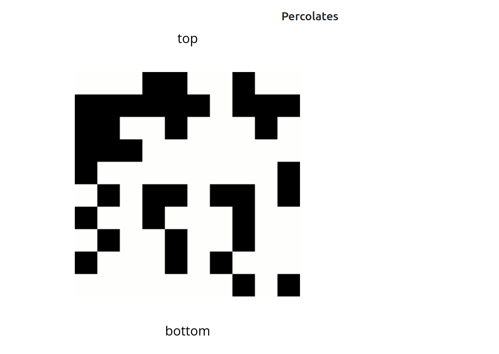
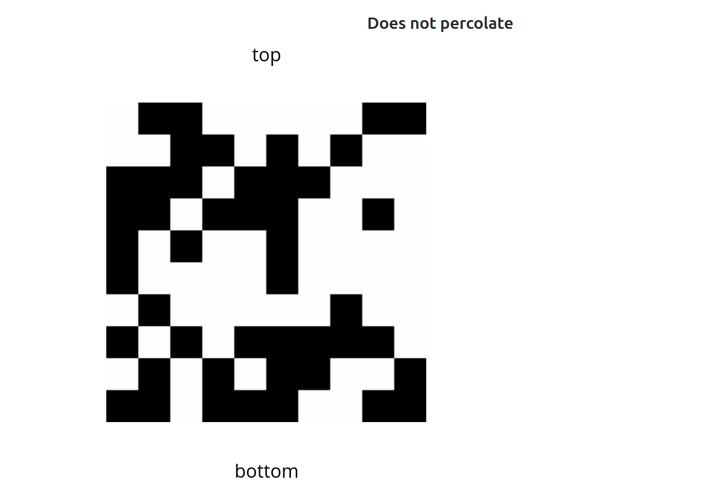
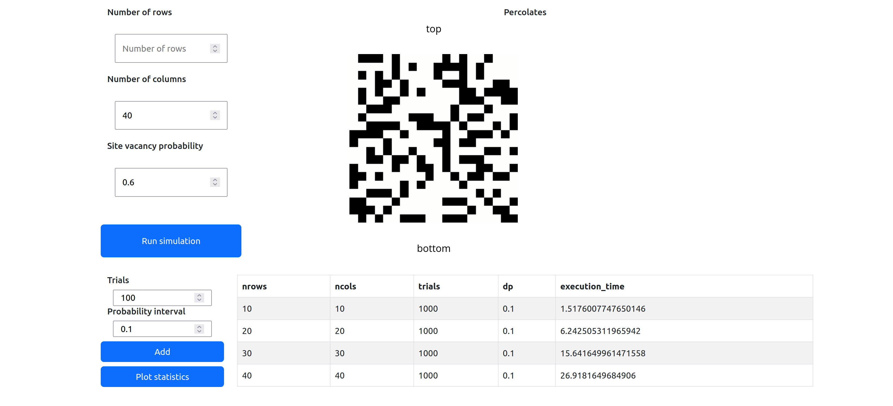
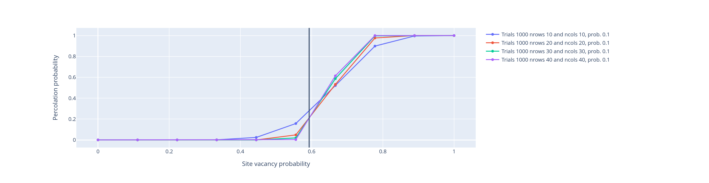

# Plotly dash application of Monte Carlo Simulation to study percolation

This repository presents the implementation of a Plotly dash application of a Monte Carlo simulation to estimate the percolation threshold of a system comprised of N-by-M sites. I deployed the web app in Heroku. You may find it in the link https://percolationmontecarlo.herokuapp.com/.
A system percolates if the top and bottom sites are connected. This model may represent many physical systems, such as fluid flow inside a porous medium. For instance, in a percolated system, as shown in the figure below, there is a flow or connection between the top and bottom. 
The opposite is valid for a non-percolated system. Blocked sites are represented as black, and open ones are white.

## Optimized Quick-Union algorithm with Weighting and Path Compression
The sites are initialized as blocked. Randomly, some of the sites are opened. When a site becomes open, the connectivity between the present site and the sites in the neighborhood is checked. Quick-union algorithm works for this dynamic connectivity problem. For this reason, the repository contains the object-oriented implementation of quick-union with path compression and weighting. 

It is possible to add simulations to plot together to see the effect of parameters in the achievement of a sharper transition.

